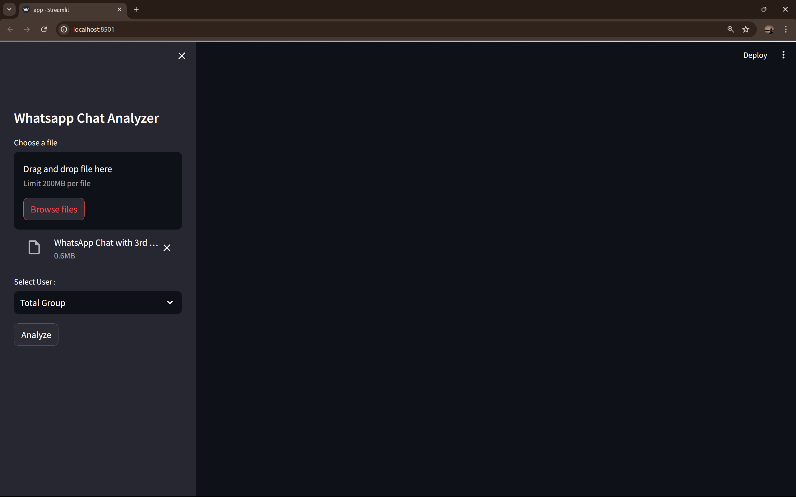
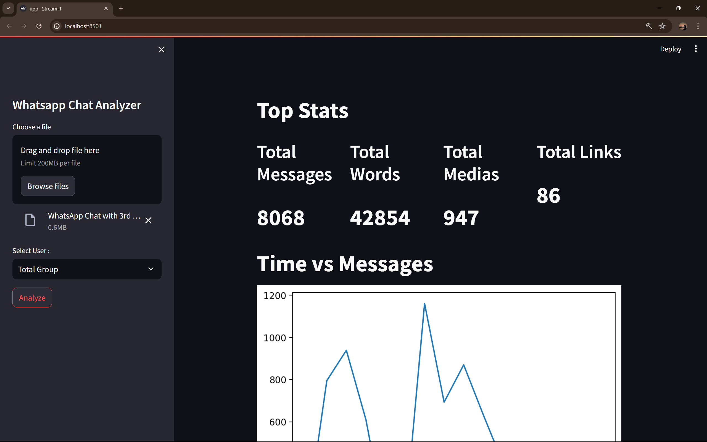
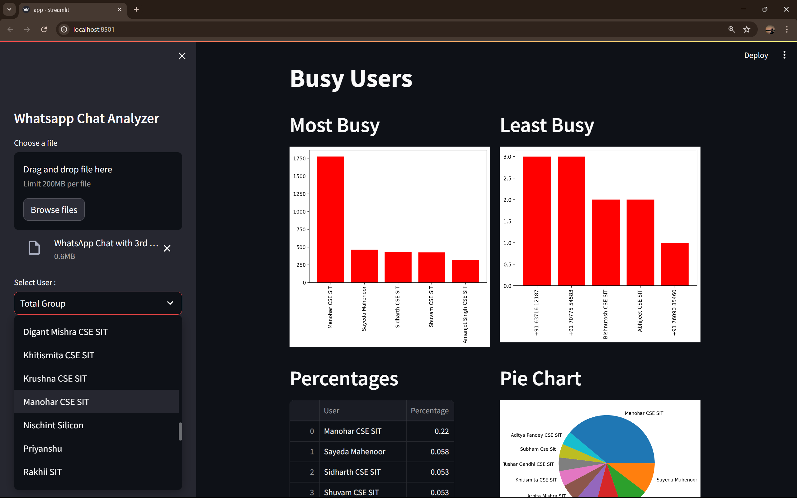

# WhatsApp Chat Analyzer

This Streamlit application allows users to upload their WhatsApp chat files and analyze various statistics and trends from the chat data.

## Features
- Fetch and display unique users from the chat.
- Analyze total messages, words, media files, and links.
- Time-wise message analysis.
- Activity maps for days and months.
- Weekly activity heatmap.
- Identify busiest and least busy users.
- Generate word cloud for the most used words.
- Emoji analysis.

## Requirements
- Python 3.8+
- Streamlit
- Pandas
- Matplotlib
- Seaborn
- urlextract
- wordcloud
- emoji

## Installation

1. Clone the repository:
   ```bash
   git clone https://github.com/MrProgrammerr/WhatsappChatAnalyzer
   cd WhatsappChatAnalyzer
   ```
Create a virtual environment and activate it:

```bash
python -m venv venv
source venv/bin/activate  # On Windows, use `venv\Scripts\activate`
```
Install the required packages:

```bash
pip install -r requirements.txt
```
Download the stop words file:

Save the stop words file stop_hinglish.txt to the project directory.
## Usage
Run the Streamlit application:

```bash
streamlit run app.py
```
Open your web browser and go to http://localhost:8501.

Upload your WhatsApp chat file using the sidebar.

Select a user from the dropdown to analyze the chat data.

Click on the "Analyze" button to view various statistics and trends.

## Screenshots

### Home Page


### Upload File



### Click Analyze




### Select Chat Member



### Click Analyze
